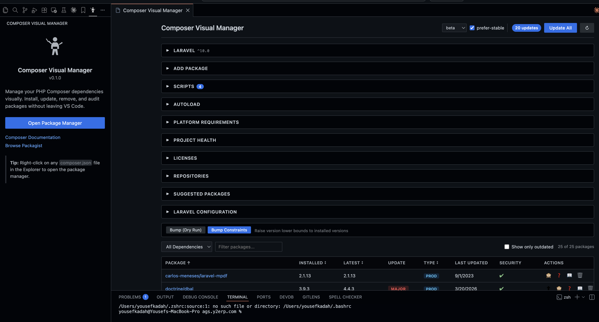
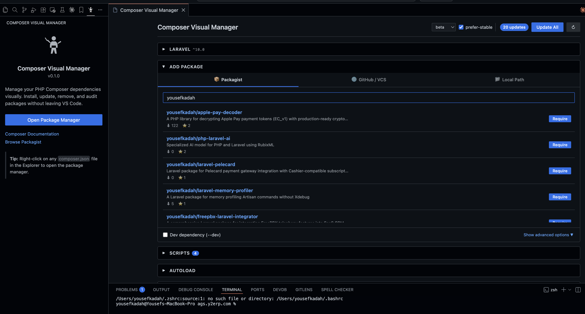
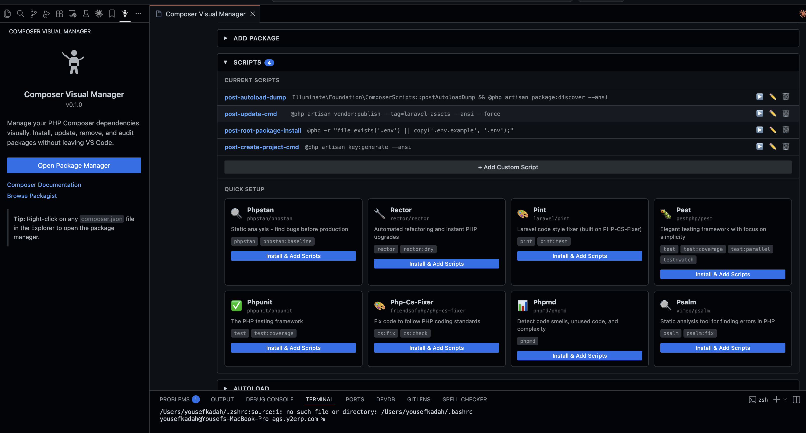
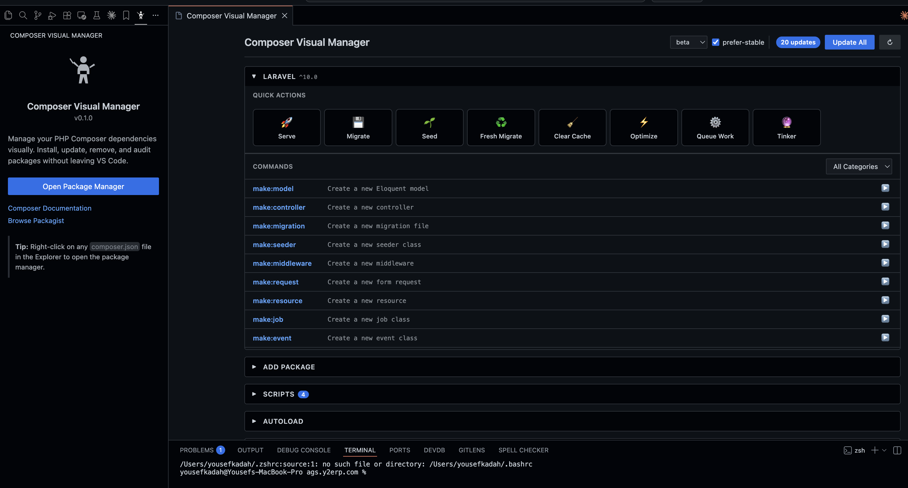
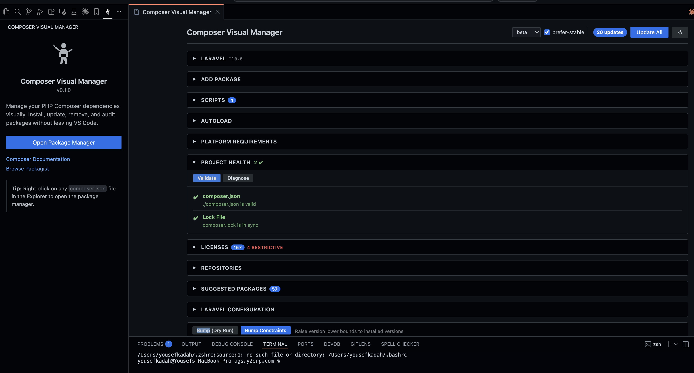
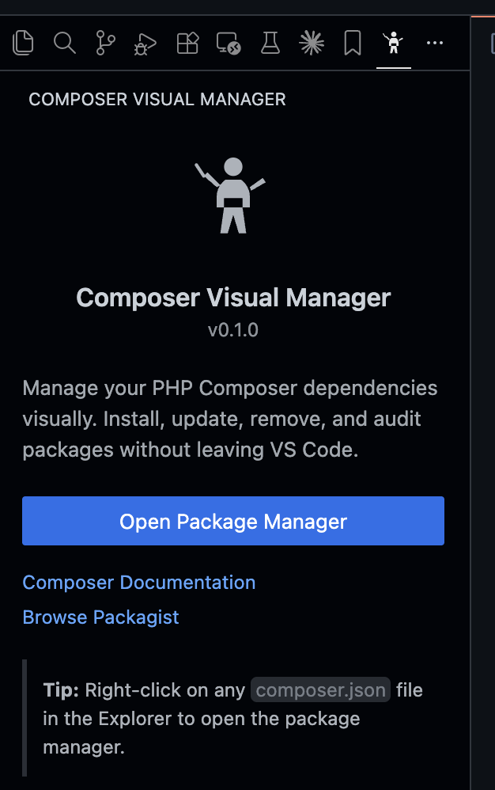

# Composer Visual Manager

Manage your PHP Composer dependencies visually. Install, update, remove, and audit packages without leaving VS Code.


---



## Highlights

- **Full dependency table** — View all packages with installed/latest versions, update type, security status, and more
- **Install from anywhere** — Packagist, GitHub, or local paths with advanced options
- **One-click updates** — Update individual packages or everything at once
- **Security auditing** — Detect vulnerabilities with `composer audit` integration
- **Framework-aware** — Auto-detects Laravel, Symfony, WordPress, and more with quick actions
- **Project health** — Validate `composer.json`, diagnose issues, and check lock file sync
- **Scripts manager** — Run, add, and edit scripts with quick setup for popular tools
- **License compliance** — Spot restrictive licenses (GPL, AGPL) across all dependencies

---

## Features

### Dependency Management

View, filter, sort, and manage all your Composer packages in one place. Filter by production or dev dependencies, search by name, and see outdated packages at a glance with color-coded semver indicators (major/minor/patch).

- Install, update, remove, and rollback packages
- Bump version constraints to match installed versions
- Ignore packages from update checks with reasons


---

### Package Installation

Search and install packages from three sources:

- **Packagist** — Search the public registry with live results
- **GitHub / VCS** — Install directly from a repository URL
- **Local Path** — Browse and install from a local directory

Advanced options include dev dependency toggle, version pinning, prefer source/dist, and more.



---

### Scripts & Tool Setup

Manage your Composer scripts and set up popular PHP tools with one click. The Quick Setup panel provides pre-configured scripts for:

**PHPStan** | **Rector** | **Laravel Pint** | **Pest** | **PHPUnit** | **PHP-CS-Fixer** | **PHPMD** | **Psalm**

Each tool suggestion installs the package and adds the relevant scripts to your `composer.json` automatically.



---

### Framework Detection

Automatically detects your PHP framework and provides quick actions and commands specific to it.

**Laravel** — Serve, Migrate, Seed, Fresh Migrate, Clear Cache, Optimize, Queue Work, Tinker, and all Artisan `make:` commands. Also manage service providers, aliases, and package auto-discovery.

**Symfony** | **WordPress** | **Yii** | **CakePHP** | **CodeIgniter** | **Slim** — Detected with framework-specific commands.



---

### Project Health

Run validation and diagnostics to keep your project in good shape.

- **Validate** — Check `composer.json` for errors
- **Diagnose** — Run `composer diagnose` for system-level issues
- **Lock File** — Verify `composer.lock` is in sync

Results are shown with clear status indicators and actionable hints.



---

### Sidebar Quick Access

Access Composer Visual Manager from the activity bar. The sidebar shows your project info, links to Composer documentation and Packagist, and a quick-open button.

Right-click any `composer.json` file in the explorer to open the manager directly.



---

### Security Auditing

- Run `composer audit` to detect known vulnerabilities
- View security advisories and CVEs per package
- Security column in the dependency table with visual indicators

### Autoload Configuration

- Manage PSR-4, PSR-0, classmap, and files entries
- Add to `autoload` or `autoload-dev`
- Dump autoloader with optimization options (classmap, authoritative, APCu)

### Platform Requirements

- View and manage PHP version and extension requirements (`ext-*`)
- Check requirements against your system with status indicators
- Quick-add common extensions (mbstring, json, openssl, pdo, curl, gd, xml, zip, intl, redis)

### Licenses

- View all package licenses grouped by type
- Identify restrictive licenses (GPL, AGPL, SSPL, EUPL) with warning badges
- See total count of restrictive dependencies

### Repositories

- View, add, and remove Composer repositories
- Supports VCS, Composer, Path, Artifact, and Package types

### Suggested Packages

- View packages suggested by your installed dependencies
- See suggestion reasons and install with one click

### Stability & Version Control

- Set minimum stability (stable, RC, beta, alpha, dev)
- Toggle `prefer-stable`
- Bump version constraints to installed versions (with dry-run preview)

### Dependency Analysis

- `composer why` — Understand why a package is installed
- `composer why-not` — Understand why a specific version can't be used

---

## Getting Started

### Installation

**From VS Code Marketplace:**

1. Open VS Code
2. Go to Extensions (`Ctrl+Shift+X` / `Cmd+Shift+X`)
3. Search for **Composer Visual Manager**
4. Click **Install**

**From VSIX:**

1. Download the `.vsix` file from [Releases](https://github.com/yousefkadah/composer-Visual-manager/releases)
2. Open the Command Palette (`Ctrl+Shift+P` / `Cmd+Shift+P`)
3. Run **Extensions: Install from VSIX...**
4. Select the downloaded file

### Usage

Open Composer Visual Manager in three ways:

1. **Activity Bar** — Click the Composer icon in the sidebar
2. **Command Palette** — Run `Open Composer Visual Manager`
3. **Context Menu** — Right-click any `composer.json` file in the explorer

The extension automatically watches `composer.json` for changes and refreshes the UI.

### Requirements

- VS Code 1.85.0 or higher
- [Composer](https://getcomposer.org/) installed and available in your PATH
- PHP installed (required by Composer)

---

## Extension Settings

| Setting | Default | Description |
|---------|---------|-------------|
| `composerVisualManager.columns.type` | `true` | Show dependency type column |
| `composerVisualManager.columns.lastUpdate` | `true` | Show last update date column |
| `composerVisualManager.columns.security` | `true` | Show security audit column |
| `composerVisualManager.columns.semverUpdate` | `true` | Show semver update type column |
| `composerVisualManager.columns.phpVersion` | `false` | Show required PHP version column |
| `composerVisualManager.ignoredPackages` | `[]` | Packages to ignore for update checks |

---

## Contributing

```bash
# Clone the repository
git clone https://github.com/yousefkadah/composer-Visual-manager.git

# Install dependencies
npm install
cd webview-ui && npm install && cd ..

# Development mode (watch + webview dev server)
npm run dev

# Build for production
npm run build

# Package as VSIX
npx @vscode/vsce package
```

---

## License

[MIT](LICENSE)
